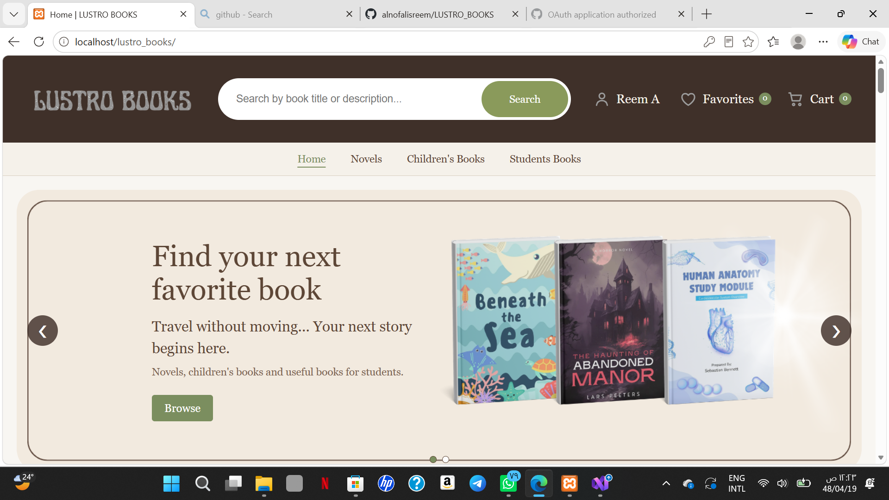
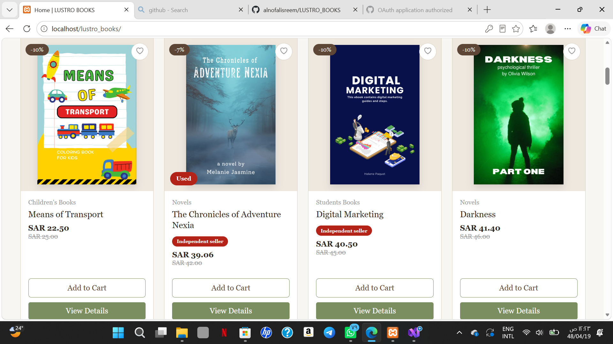
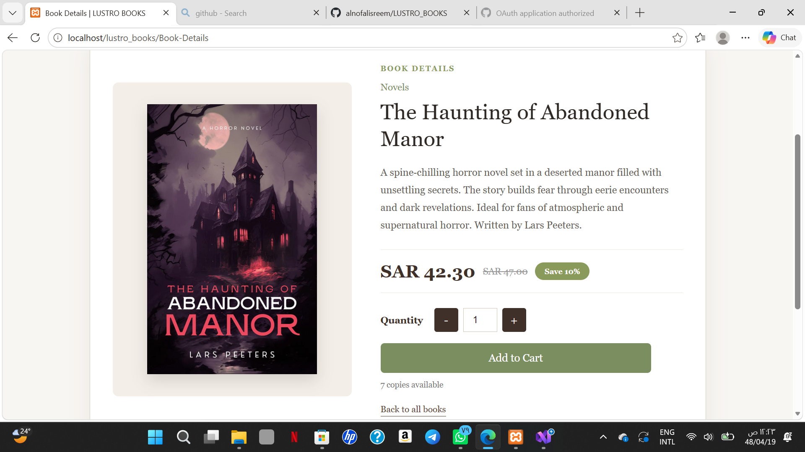
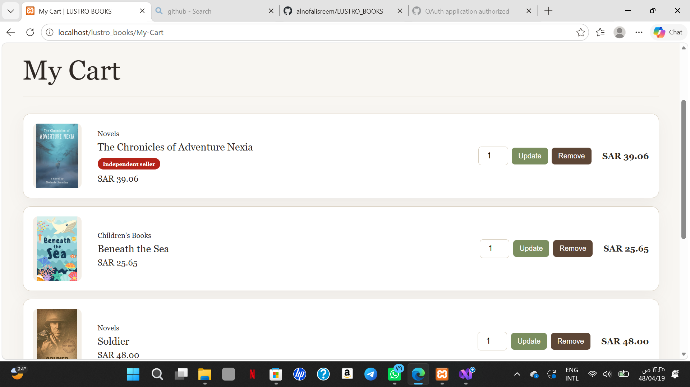
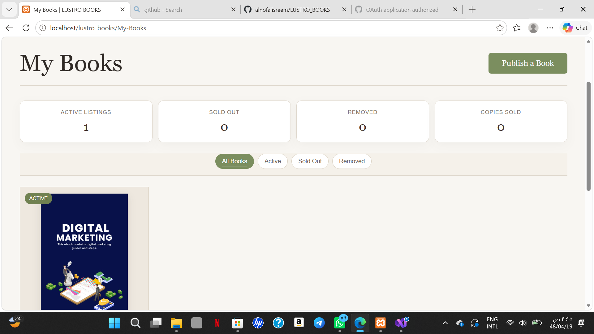

# LUSTRO BOOKS 

LUSTRO BOOKS is a demo bookstore website I built as a portfolio project to practice web development with PHP and MySQL.

Users can browse books, add them to their cart or favorites, and place orders. They can also choose to become sellers when creating an account and publish their own books.

## Features

- Account registration with email verification
- Sign in and sign out
- Search for books and browse by category
- View book details and available quantities
- Add books to the cart or favorites
- Update cart quantities and place orders
- View previous orders
- Cancel pending orders within 24 hours
- Publish and remove books through a seller account
- Receive verification codes and order updates by email

## Technologies Used

- HTML
- CSS
- JavaScript
- PHP
- MySQL
- PHPMailer
- XAMPP

## Main Folders

- `image` — Images used on the website
- `icon` — Website icons
- `uploads` — Book images uploaded by sellers
- `vendor` — PHPMailer library files

## Project Status

This project was built for learning and portfolio purposes and is still under development. Some areas still need improvement, including order error handling and form security.

The store is a demo and does not process real payments, deliveries, or seller payouts. Email verification and order notifications send real emails when the email service is configured.

## Screenshots

### Home

### Browse Books

### Book Details

### My Orders

### Seller Dashboard

